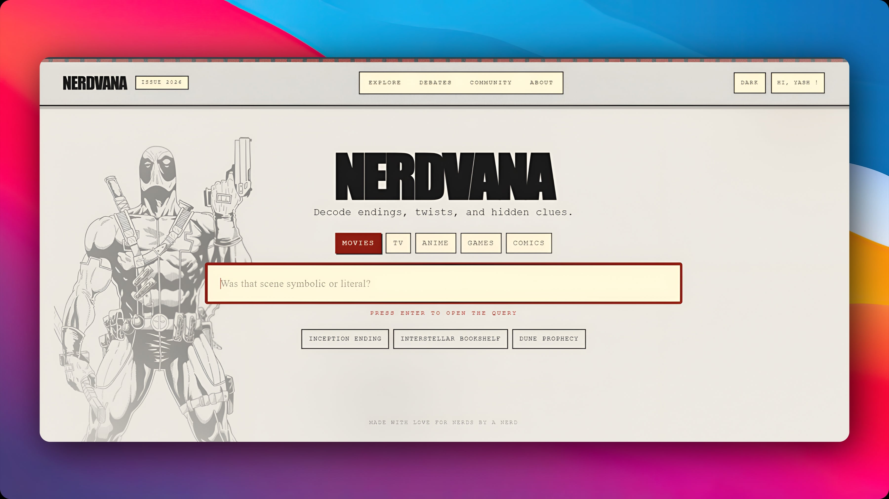
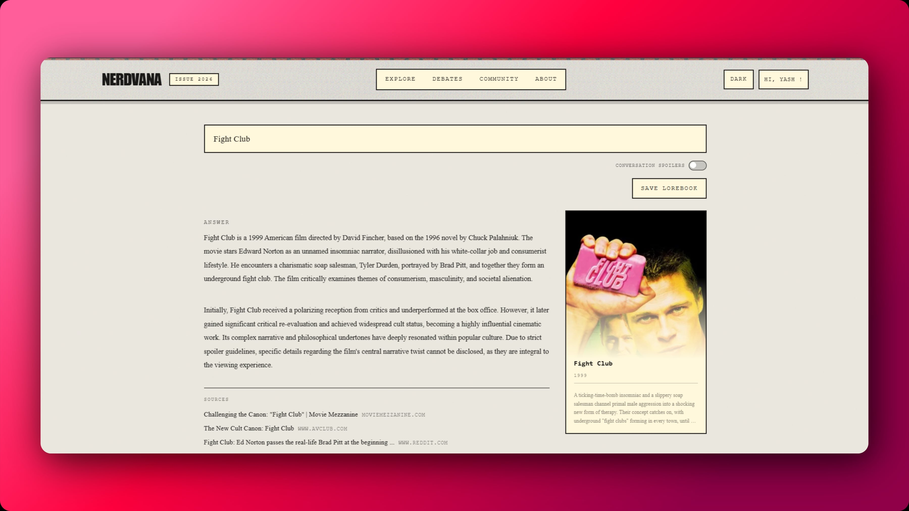
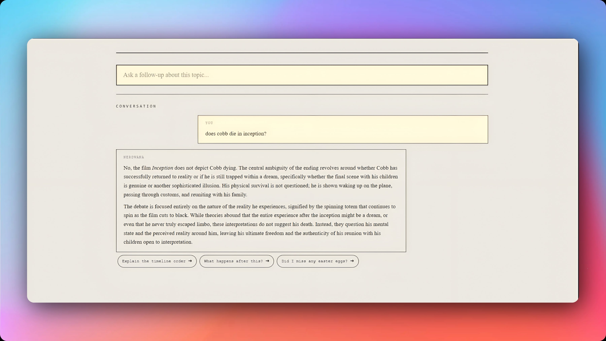

# 🧠 Nerdvana

> AI-powered search + conversation platform for structured, context-aware exploration.

Nerdvana combines real-time web search with conversational AI in a **search-first → follow-up** experience (Perplexity-style).

---

## 🚀 Live Demo  
https://nerdvana.vercel.app  

---

## 📸 Screenshots  

### 🏠 Home  

### 🔍 Search  

### 💬 Follow-ups  

---

## ✨ Features  

- 🔍 Search-first interface  
- 💬 Conversational follow-ups  
- 🧠 Context-aware responses  
- 🎬 Spoiler-aware handling  
- ⚡ Fast, lightweight UI  

---

## 🧠 Built with Codex  

Used OpenAI Codex to:
- Generate React + TypeScript components  
- Debug async flows  
- Structure app logic  
- Speed up development  

---

## 🏗️ Tech Stack  

- **Frontend:** React (Vite), Tailwind CSS  
- **Backend:** Firebase Auth, Firestore  
- **Search:** Serper API (Google Search API)  
- **AI:** Gemini 2.5 Flash  
- **Deployment:** Vercel  

---
