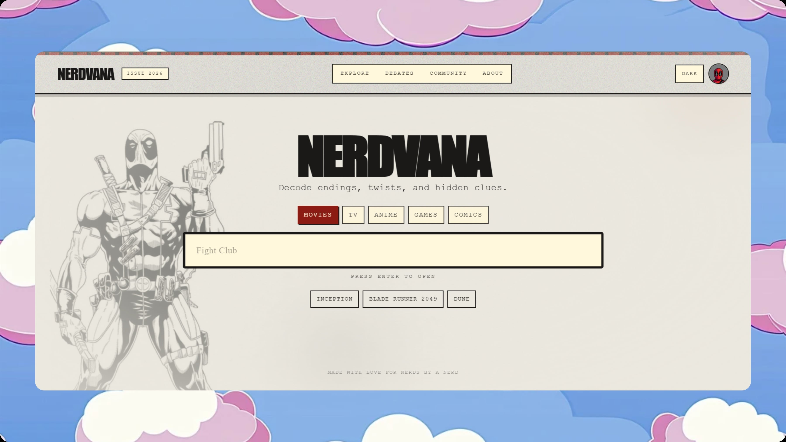
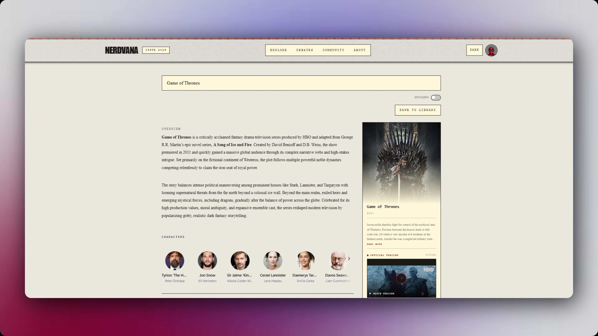
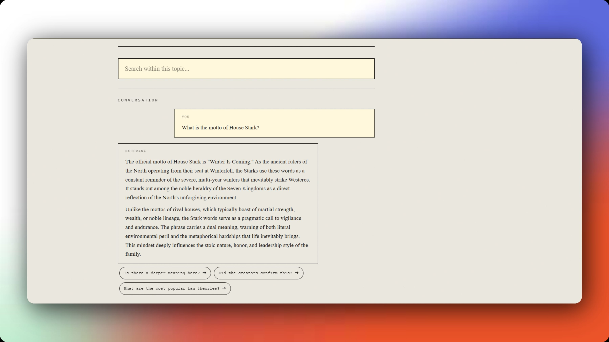
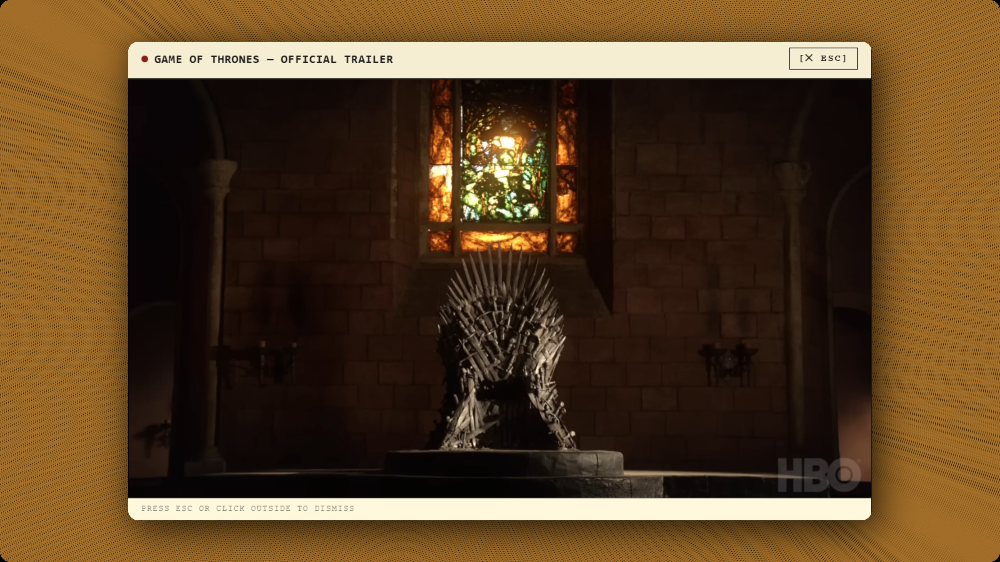

# Nerdvana

A conversational search tool for movies, TV, anime, games, and comics. Ask about a title, then keep asking. Spoiler control and saved conversations built in for going deep on one universe, not just looking something up.

**Live app:** [nerdvana-murex.vercel.app](https://nerdvana-murex.vercel.app)

## What it does

Search for a title, read the answer, then keep asking. Follow-up questions stay in context, so you can go from "who is this character" to "how does this connect to the sequel" without starting over.

## Features

**Search**
- Follow-up questions that keep context
- Autocomplete while typing
- Explore mode for related titles
- Spoiler toggle

**Media**
- Poster and metadata for each title
- Trailer playback

**Account**
- Sign in with Firebase
- Search history synced across devices
- Saved Library to keep conversations for later

## Screenshots

### Home

### Search

### Conversation

### Trailer

## Tech stack

| Layer | Tools |
|---|---|
| Frontend | React, TypeScript, Vite, Tailwind CSS, Zustand, Framer Motion, React Markdown |
| Backend | Vercel Serverless Functions, Firebase Authentication, Cloud Firestore |
| Language models | Google Gemini, Groq |
| Search | Serper API |
| Data providers | TMDB, RAWG, IGDB, ComicVine, Jikan, AniList, Google Books |

## How it's built

A single-page app talking to Vercel Serverless Functions, which handle the language model calls, search, and requests to the media data providers. Firebase handles login and stores user data in Firestore.

## License

Copyright © 2026 Yash Kaushik. All rights reserved.

Public for viewing and evaluation only. Copying, modifying, distributing, or using any part of this code requires written permission from the copyright holder.
